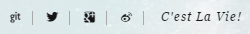
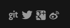
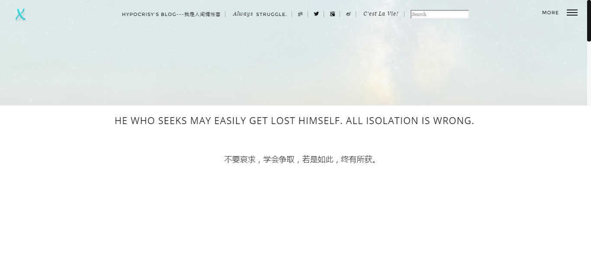
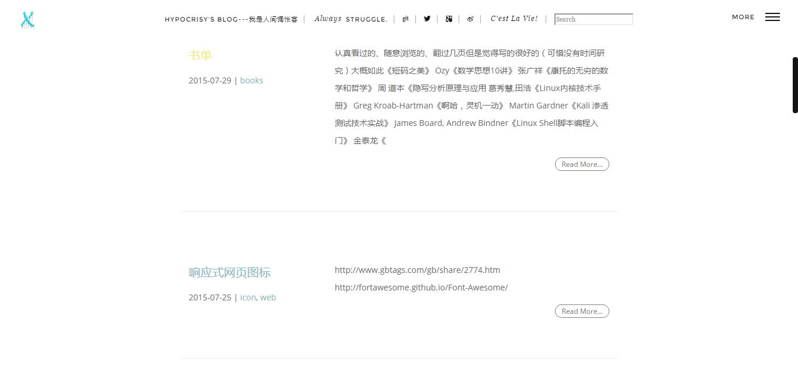

# hypocrisy
hypocrisy is a responsive design theme for Hexo.
**This theme is based on [Kieran's Blog](http://go.kieran.top)**

I changed some css style,
add tags and sitemap in sidebar,
add search on the nav,
add google analytics and fancybox.
and there are some other changes, but i cannot list all.

In addition, I remove the scroll image for articles, only remains the scroll image in index pages.

And I add google_analytics and music.

[Demo| Hypocrisy's Blog](http://hypocrisy.info)

###Install
Execute the following command and modify theme in <code>_config.yml</code> to <code>hypocrisy</code>.
```
git clone https://github.com/hecate-xw/hexo-theme-hypocrisy.git
```
<!--more-->
###Update
Execute the following command to update hypocrisy.
``` 
cd themes/hypocrisy
git pull
```
###Config
####Theme_config.yml
```
cover: /img/bg_img.jpg  #This is no use currently, In fact, it is 01.jpg that represent the cover.
logo: /img/logo.png
top_saying:
- title: YOU'VE MADE A <span>BRAVE</span> DECISION, WELCOME.
- content: 每一个不曾起舞的日子都是对生命的辜负。
bottom_saying: 虽然还没想好写点什么，但是总觉得这里放句话比较和谐。
  
excerpt_link: Read More
  
rss: /atom.xml

highlightjs: vs

works:
- works_name: Project01
  works_url: /
- works_name: Project02
  works_url: /
  
duoshuo: duoshuo_name
  
github: https://github.com/
twitter: https://twitter.com/
facebook: https://www.facebook.com/
google:  https://google.com/
weibo: http://weibo.com/
  
timeline:
- num: 1
  word: 2014/06/12-Start xxx
- num: 2
  word: 2014/11/29-Start bbb
- num: 3
  word: 2015/02/18-Start ddd
- num: 4
  word: ...
  
links:
- name: Kieran
  link: http://go.kieran.top/
- name: Hypocrisy
  link: http://hypocriys.info/

google_analytics:
  enable: true
  id: UA-*******-1  # your google analytics ID.
  site: auto            # your google analytics site or set the value as auto.```

music:
  enable: true
  link: "http://music.163.com/outchain/player?type=2&id=30854833&auto=0&height=66"  #or others

site_verification:
- name: google-site-verification
  content: your own content
- name: baidu-site-verification
  content: your own content

```
####Hexo_config.yml
change some code to enable archives page
```
# Archives                                  #This choice is no use, too. Don not change them.
## 2: Enable pagination
## 1: Disable pagination
## 0: Fully Disable
archive: 1
category: 1
tag: 1
```
###Icon
Seclet icon which you like in<code>\hypocrisy\source\css\iconList.css</code>  
  

###Screen
Show

  
Content

###Others
If you like this theme, [Fork](https://github.com/hecate-xw/hexo-theme-hypocrisy/fork) && Star.
Come on.
